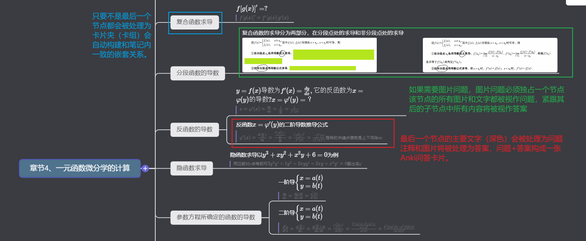
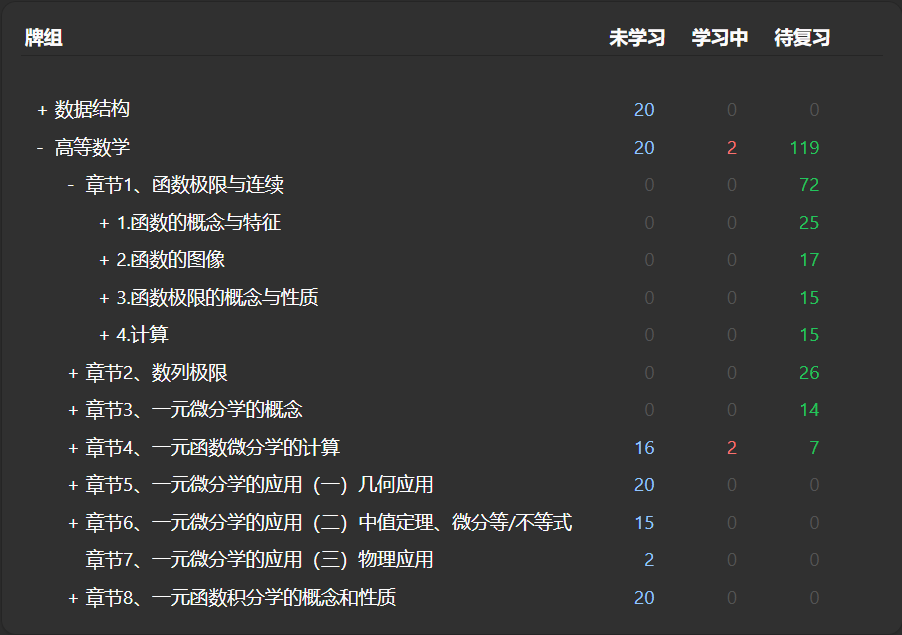
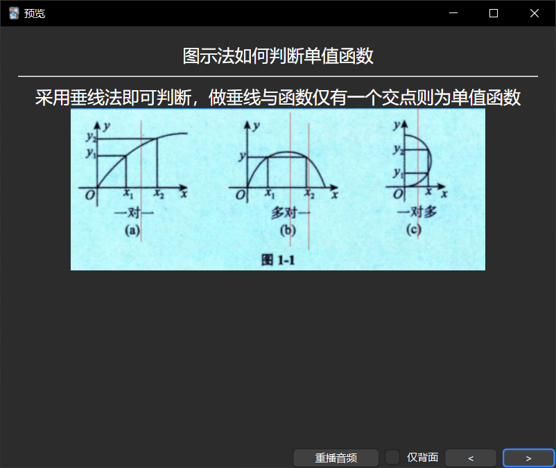

# 幕布文件导入ANKI自动制作问答卡片

## go编译可执行文件指令
```bash
go build .
```

## 配置文件说明
```json
// 注意在JSON配置文件中不允许有注释，此处只是为了说明参数
{
    "inputFilePath":"./", //指定待导入文件的路径，默认与可执行文件在同一个文间夹内
    "specificFilePath": "", //导入指定的卡片夹内，默认为""不指定
    "autoModelName":"autoModel", //自动创建的用于自动化制作卡片的模板名称，只能配置名称不能影响样式   
    "ankiConnectHost":"http://127.0.0.1:8765",  //ankiConnect插件开发的API端口默认值
    "mubuBaseUrl": "https://document-image.mubu.com/"   //mubu网站媒体资源的基地址
}
```
## 使用说明
### 对幕布笔记的格式要求
使用此脚本需要对mubu笔记的格式由一下几点要求
1. 问题和答案只能出现在最后一个节点上，粗体主要内容将被视为问题，浅体注释将被视为问题
2. 除了最后一个节点为问题和答案，其余的节点均会被制作成卡片夹（卡组），卡组的嵌套关系与笔记内一致
3. 如果需要图片作为问题，则问题图片需要独占一个节点，其子节点将被作为答案







### 如何导入到已经存在的Anki卡组
我们可以将笔记导入指定的卡片组中，比如高等数学笔记的第一章，只需更改配置文件
```json
{
    "inputFilePath":"./",
    "specificFilePath": "高等数学::章节1、函数极限与连续", //指定要导入的卡组，格式按照与创建Anki卡组一致，层级用::分隔
    "autoModelName":"autoModel",
    "ankiConnectHost":"http://127.0.0.1:8765",
    "mubuBaseUrl": "https://document-image.mubu.com/"
}
```
