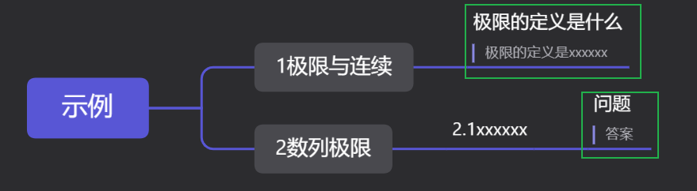
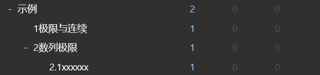
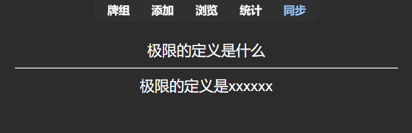
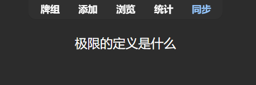
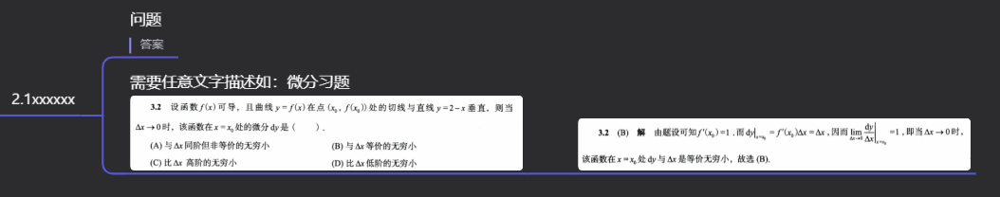
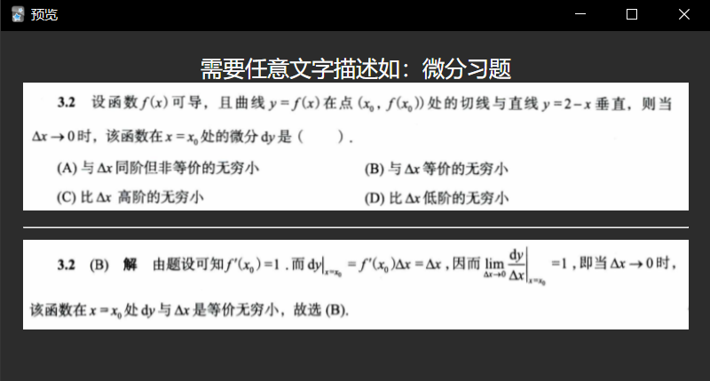
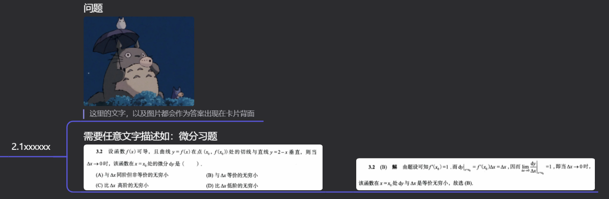
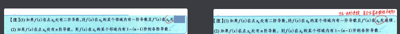
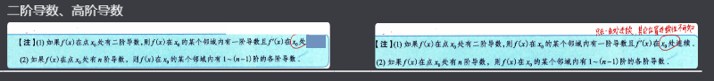
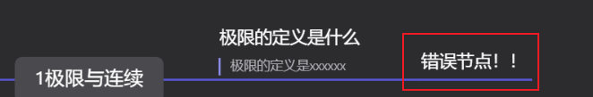

# 幕布笔记自动导入ANKI

此项目通过约定使用特定格式来编写幕布笔记，可以将满足条件的幕布笔记自动化制作为背诵卡片导入anki，并且自动生成与幕布笔记结构相同的卡片夹目录。

借助此脚本，我们在完成幕布大纲笔记后，相当于同时制作好了ANKI背诵卡片。

从另一个角度也可以视作将幕布作为ANKI的卡片编辑器，结构化和方便的制作卡片

## 使用说明
### 对幕布笔记的格式要求

如果我们将幕布笔记当作ANKI卡片的编辑器，制作一张卡片需要问题和答案两部分内容，问题和答案可以是文字或图片的组合。

我们约定:

1. **问题和答案只能出现在最后一个节点上**
    
    问题和答案只能在最后一个节点(最后面)，其余的节点都会被创建为卡片夹

    

    效果如下，不仅会创建路径一致的卡片夹，而且会将最后的节点制作成卡片

    

    

2. **问题必须是正文文字(深色文字)，答案必须是注释文字(浅色文字)**
   
    正文将会被嵌入到卡片模板中的正面(作为卡片问题),注释将被嵌入到卡片模板的背面(作为卡片答案)

   

   效果如下

   

   

3. **如果问题是图片，必须添加一段文字描述，且答案只能在其唯一的子节点上**

    如果问题中含有图片，我们要为其至少添加一段文字注释，答案需要在其后新建一个子节点

   

    效果如下


    

4. **问题和答案可以是文字和图片的组合，但当问题中有图片是需要遵循上述的约定3**

    

## 配置文件说明

项目采用json配置文件，配置文件应与可执行文件在同一目录下

```json
{
    "inputFilePath":"./", 
    "specificFilePath": "", 
    "autoModelName":"autoModel", 
    "ankiConnectHost":"http://127.0.0.1:8765",  
    "mubuBaseUrl": "https://document-image.mubu.com/"
}
```
- `inputFilePath` 
  
  指定从幕布导出的opml文件路径，推荐使用示例配置，即和启动文件(可执行文件)同一目录下。
  
- `specificFilePath` 
  
  指定导入的卡片夹。如果为""将不指定卡片夹。不指定卡片夹适用于当你一次性导出整本幕布笔记想要导入anki的时候，此时脚本将自动识别opml文件中的title标签作为根卡片夹的名称，也就是正常情况下会是你幕布笔记的名称作为根卡片夹的名称。指定卡片夹，适用于你导出了幕布笔记的一部分想要导入anki，比如某个章节，需要你提前创建卡片夹，脚本会基于指定的卡片夹来构建卡片夹目录以及导入卡片。

- `autoModelName`

    自定义用于自动化的模板名称，注意只是定义名称，不会影响脚本自动创建的模板样式，此参数只是为了方便卡片管理以及防止名称冲突。

- `ankiConnectHost` 

    anki-connect插件的服务端口，使用示例配置即可。

- `mubuBaseUrl`

    幕布网站的图片资源基础路径，使用示例配置即可。


### 如何导入到已经存在的Anki卡组

通过设置`specificFilePath`参数，指定路径即可，注意这里的路径要和安装ANKI的路径格式，如：导入到`高等数学::章节1、函数极限与连续`的意思是，导入到`高等数学`卡片夹下的`章节1、函数极限与连续`卡片夹。

```json
{
    "inputFilePath":"./",
    "specificFilePath": "高等数学::章节1、函数极限与连续", 
    "autoModelName":"autoModel",
    "ankiConnectHost":"http://127.0.0.1:8765",
    "mubuBaseUrl": "https://document-image.mubu.com/"
}
```


### 额外注意事项

1.在编写幕布笔记的时，避免出现单独一张图片作为问题，至少需要一段文字描述，否则将导致导入出错，因为此脚本创建的卡片模板，至少需要一段文字描述。
  
- 错误示范



- 正确示范



2.最后一个节将被作为卡片，其后不能有任何节点



## go编译可执行文件指令
```bash
go build .
```